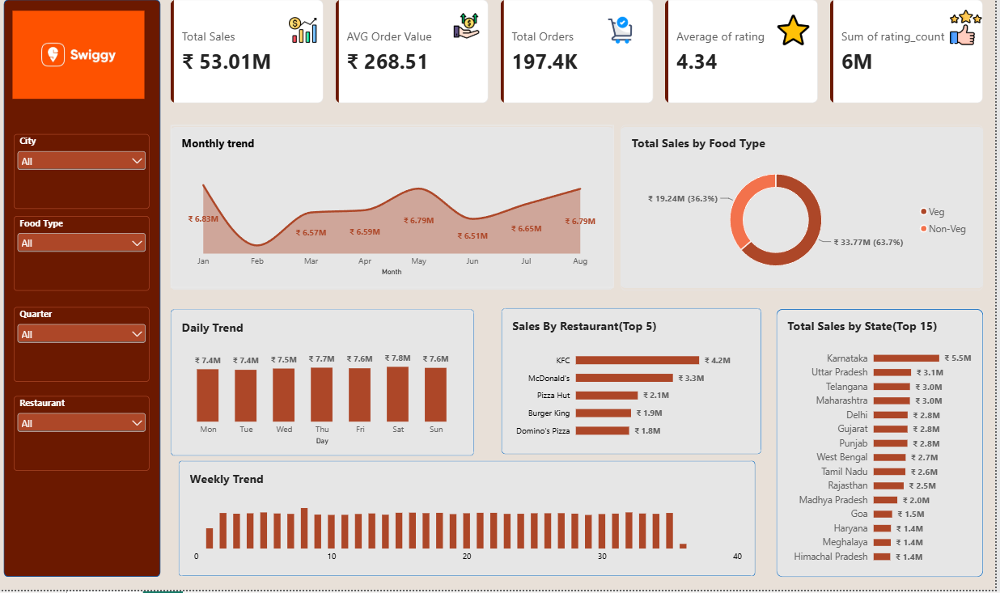

# Swiggy Sales & Order Analytics Dashboard

An end-to-end Business Intelligence project built using Microsoft Fabric, SQL, and Power BI to analyze Swiggy sales and order data.

## Project Overview

This project uses a data warehouse and dimensional data model to analyze sales, orders, restaurants, food types, locations, ratings, and time-based trends.

## Technology Stack

- Microsoft Fabric
- Fabric Warehouse
- SQL
- Direct Lake
- Power BI
- DAX
- Star Schema

## Data Model

The project uses a star-schema architecture:

- `fact_orders`
- `dim_date`
- `dim_dish`
- `dim_location`
- `dim_restaurant`

## Dashboard



## Key Metrics

- **Total Sales:** ₹53.01M
- **Total Orders:** 197.4K
- **Average Order Value:** ₹268.51
- **Average Rating:** 4.34
- **Rating Count:** 6M

## Analysis

The dashboard provides:

- Monthly sales trends
- Daily sales trends
- Weekly trends
- Sales by food type
- Top 5 restaurants by sales
- Top 15 states by sales
- Interactive filtering by city
- Interactive filtering by food type
- Interactive filtering by quarter
- Interactive filtering by restaurant

## Project Workflow

```text
Data
  ↓
Fabric Warehouse
  ↓
SQL / Data Preparation
  ↓
Star Schema
  ↓
Direct Lake Semantic Model
  ↓
Power BI
  ↓
Interactive Dashboard
